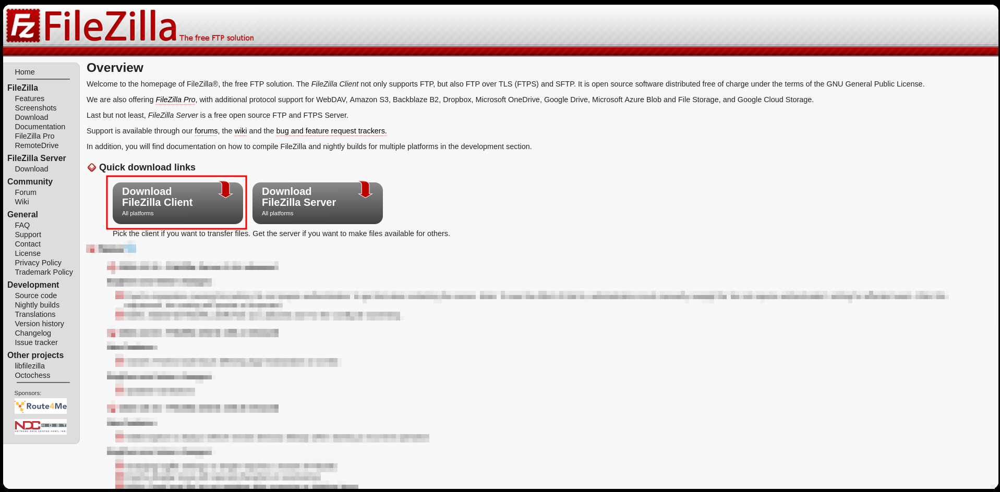
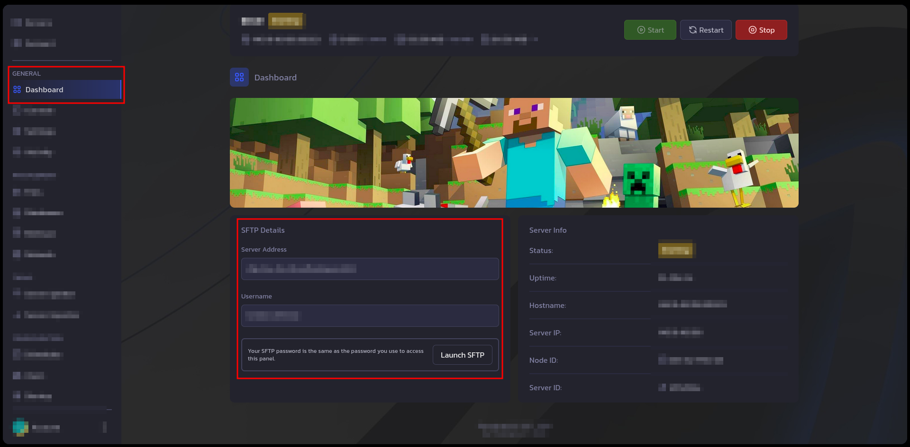
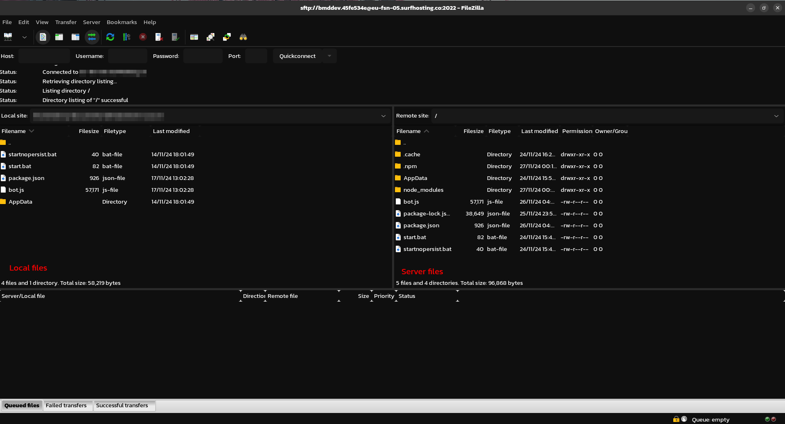

# Uploading Discord Bot Files to Your VPS Using FileZilla
Here's a step-by-step guide to uploading your Discord bot files to your VPS host using FileZilla.

---

### **1. Install FileZilla**
1. Download FileZilla Client from the [official website](https://filezilla-project.org/).
2. Follow the installation instructions for your operating system.

---

### **2. Get Your VPS FTP Details**
- Gather the following information from your VPS provider:
  - **Host**: Your server's IP address or hostname.
  - **Username**: Your VPS login username.
  - **Password**: Your VPS login password.
  - **Port**: Typically 21 for FTP or 22 for SFTP (secure FTP).

---

### **3. Open FileZilla**
1. Launch FileZilla.
2. Enter the following details at the top:
   - **Host**: Your VPS IP/hostname.
   - **Username**: Your login username.
   - **Password**: Your login password.
   - **Port**: Enter 22 for SFTP (recommended for security).

3. Click **Quickconnect**.

---

### **4. Navigate to Your VPS Directory**
- Once connected:
  - The **left panel** shows your local files.
  - The **right panel** shows files on your VPS.
  - Navigate to the appropriate directory on your VPS for hosting your bot (e.g., `/home/yourusername/discord-bot`).

> **Image Idea**: Screenshot showing the local and remote panels in FileZilla with an example directory.

---

### **5. Upload Your Bot Files**
1. On the left panel, navigate to the folder containing your Discord bot files.
2. Drag and drop the files or folders from the **left panel** (local) to the **right panel** (VPS).
3. Wait for the upload to complete. The status bar at the bottom of FileZilla will show progress.

> **Image not yet added**: Screenshot of a file transfer in progress, highlighting the drag-and-drop functionality and status bar.

---

### **6. Set Permissions (Optional)**
- Right-click uploaded files on the VPS (in the right panel) and choose **File Permissions**.
- Ensure the correct permissions are set for your bot files (e.g., `755` for executable scripts).

> **Image not yet added**: Dialog box screenshot for file permission settings in FileZilla.

---

### **7. Test Your Bot**
1. SSH into your VPS (if needed) to navigate to the bot directory.
2. Run your bot using the appropriate command, e.g., `node bot.js` or `python bot.py`.

> **Image not yet added**: Terminal screenshot showing an example command to start the bot.

---

### **8. Troubleshooting Tips**
- **Connection Issues**: Verify your credentials and ensure the VPS's firewall allows FTP or SFTP access.
- **File Not Found**: Double-check that you uploaded files to the correct directory.